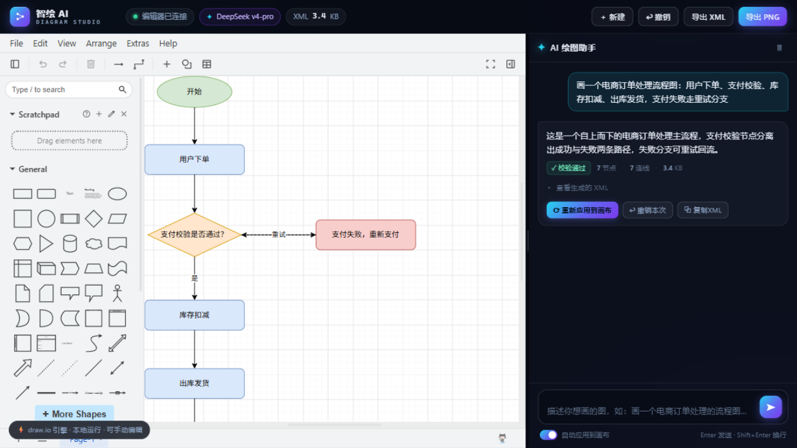
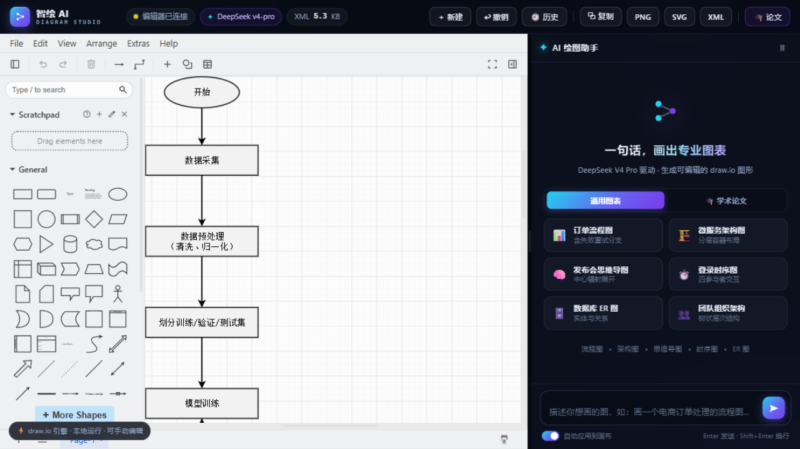
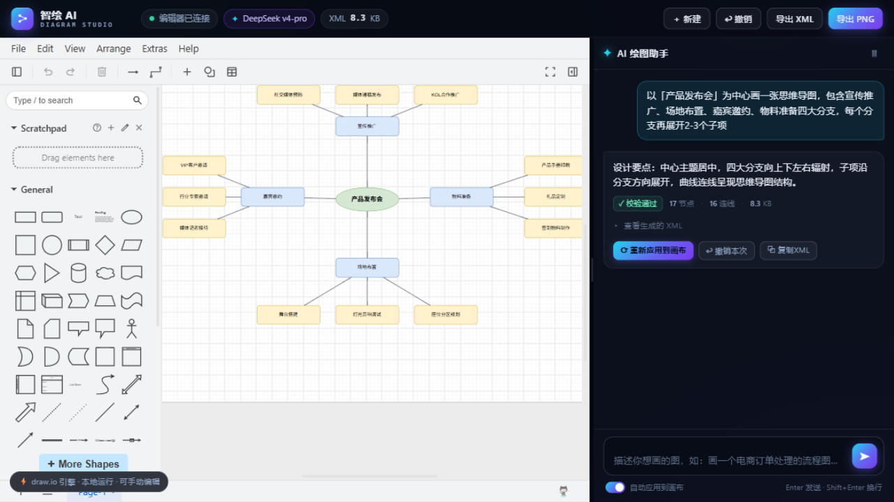

# 智绘 AI · Diagram Studio

> 用一句话，画出专业图表 —— 基于 draw.io 开源引擎 + DeepSeek V4 Pro 的 AI 智能绘图工具，为毕业论文制图深度优化

通过自然语言对话，AI 自动生成**可编辑**的流程图 / 架构图 / 思维导图 / 时序图 / ER 图，实时渲染到 draw.io 画布。支持连续对话增量修改、论文级灰阶与字体规范、矢量导出、版本历史与图注编号管理。前端零构建、后端零依赖（纯 Node 内置模块）。

   

---

## 📸 效果预览

**AI 生成彩色流程图（自然语言 → 画布）**



**论文模式：灰阶 + 统一字体的学术实验流程图**



**思维导图（中心辐射布局）**



## ✨ 核心特性

| 能力 | 说明 |
|---|---|
| 🗣️ 自然语言生图 | 输入中文描述，DeepSeek 生成 draw.io 兼容 XML，校验后自动渲染到画布 |
| 💬 连续对话修改 | 增量编辑：每轮携带画布最新 XML，只改你要求的部分，保留手动调整过的元素与坐标 |
| 🎓 论文模式 | ① 灰阶配色（亮度 5 档映射、深底自动反白，黑白打印友好）② 图内字体（宋体/黑体/楷体/仿宋/Times）③ 全局风格（字号/线宽/圆角三档预设），应用时自动转换 |
| 🕘 版本历史 | 每次 AI 应用自动落盘存档（`snapshots/` 目录，保留最近 100 份），可视化载入 / 下载 / 删除，改稿可随时回滚 |
| 📑 图注编号 | 按章节自动编号（图3-1、图3-2…），一键复制图目录清单，导出文件名自动携带编号与标题 |
| 📤 矢量导出 | SVG（论文排版推荐）/ 高清 PNG（scale=3 ≈300 DPI）/ `.drawio` 源文件 / 一键复制 PNG 到剪贴板（Word 中 Ctrl+V 直接粘贴） |
| 🧪 学术模板 | 技术路线图 / 系统三层架构 / 算法流程图（ISO 规范符号）/ 实验流程 / 神经网络结构 / 进度甘特图，另有 6 个通用模板 |
| ↩️ 一键撤销 | 撤销上一次 AI 应用（独立撤销栈，与画布内部撤销互不干扰） |
| 🔄 实时同步 | draw.io `autosave` 事件持续回传画布状态，手动拖拽微调后 AI 下一轮自动基于新状态修改 |
| 🛡️ 可靠生成 | 服务端 XML 校验与自动修复（未转义 `&`、value 内裸 `<`、缺失 0/1 图层节点等），不合格自动带错误信息重试一次 |
| 🔒 本地引擎 | draw.io 完整编辑器本地静态托管，图数据不出本机；仅生成请求发往大模型 API |
| 🎨 科技感 UI | 深色玻璃拟态 + 青紫渐变、流式生成动画、思考计时、可拖拽分栏、Toast 通知 |

## 🚀 快速开始

**环境要求**：Node.js ≥ 18（使用内置 `fetch`）、Git；无需 `npm install`（零依赖）。

```bash
# 1. 克隆本项目
git clone https://github.com/zmccyy/self-draw.io.git
cd self-draw.io

# 2. 首次运行（Windows）
#    直接双击 start.bat：自动克隆 draw.io 引擎源码（约231MB，仅一次）
#    并引导创建 .env 填入 DeepSeek API Key，然后启动并打开浏览器
#
#    其他平台 / 手动方式：
git clone --depth 1 https://github.com/jgraph/drawio.git drawio-src
cp .env.example .env      # 编辑 .env 填入你的 DEEPSEEK_API_KEY
node server.js

# 3. 访问 http://localhost:3210
```

**第一次使用**：点击右侧「🎓 学术论文」或「通用图表」模板，或直接输入描述（如"画一个用户登录流程图，验证失败要提示"），等待 30~120 秒生成后图表自动出现，随后可继续对话修改。

## 🎓 论文工作流（推荐按此顺序）

1. **配置规范**：顶栏「🎓 论文」→ 开启**灰阶模式**、选择**图内字体**（如宋体）与**全局风格**（论文标准：14 号字 / 2px 线 / 直角）
2. **生成图表**：选学术模板或自由描述 → 自动应用（已带灰阶与统一字体）→ 画布手动微调
3. **登记图目**：论文面板填章节号与图标题 →「＋ 记录当前图」→ 自动编号 图3-1、图3-2…
4. **导出插图**：**SVG**（Word 2016+ / LaTeX 矢量排版首选）或 **⧉ 复制**（剪贴板直贴 Word）；文件名形如 `图3-1_系统总体架构.svg`
5. **管理版本**：每次 AI 应用已自动存档；「🕘 历史」可载入任意历史版本，写作全程可回滚
6. **正文引用**：「⧉ 复制图目录」得到 `图3-1 ×××` 清单，与论文图注一一对应

## 🏗️ 架构与工作原理

```
┌──────────────────── 浏览器 ─────────────────────┐
│  前端 Shell（public/，原生 JS 零构建）            │
│  ┌─────────────────────┐   ┌─────────────────┐  │
│  │ draw.io 编辑器       │   │ AI Agent 面板    │  │
│  │ iframe 本地引擎      │◄──┤ 对话/流式/论文设置│  │
│  │ (完整编辑能力)       │   │ 图注/历史/导出   │  │
│  └──────────┬──────────┘   └────────┬────────┘  │
│             │ postMessage           │ fetch SSE │
│             │ (embed JSON 协议)      │           │
└─────────────┼───────────────────────┼───────────┘
              │                       ▼
    init / load / autosave /   ┌────────────────────┐
    export / merge             │ server.js（零依赖）  │
              ▲                │ · SSE 流式代理       │
              │                │ · XML 校验/修复/重试 │
              │                │ · 快照落盘 API       │
              │                │ · 静态托管           │
              │                └─────────┬──────────┘
              │                          ▼
              │               DeepSeek V4 Pro API
              │            （生成 draw.io 兼容 XML）
              └──── /drawio/* 静态资源 ──── jgraph/drawio 源码
```

**四个关键机制**

1. **draw.io 本地引擎**：服务器把 `jgraph/drawio` 仓库的 `src/main/webapp`（含官方预构建 `app.min.js`，约 9.6MB）托管在 `/drawio/`，前端 iframe 以 `?embed=1&proto=json&libraries=1&noSaveBtn=1&noExitBtn=1` 加载 —— 拥有完整编辑能力且数据不出本机。
2. **embed JSON 协议**：编辑器 `init` 握手后，前端用 `{action:'load', xml, autosave:1, fit:1}` 应用 AI 结果；`autosave` 事件持续回传画布最新 XML（作为下一轮对话上下文）；`{action:'export', format, scale}` 导出 PNG/SVG。
3. **生成管线**：`POST /api/chat` 将「系统规范提示词（含 XML 模板/配色/布局/学术图表规范 + few-shot）＋ 历史对话（剥离历史 XML 防 token 膨胀）＋ 画布当前 XML ＋ 用户指令」发给 DeepSeek；SSE 流式返回；服务端提取 ```xml 代码块、校验修复，失败自动重试一次。
4. **论文变换管线**：应用到画布前执行 `ThesisTransform.enhance()` —— 全局风格 → 字体注入 → 灰阶映射，三步纯字符串变换（`public/js/thesis.js`），与 AI 生成解耦，对手动绘制同样生效。

## 📁 目录结构

```
draw.io/
├── server.js               # 零依赖 Node 服务器：静态托管 + /api/chat SSE + 快照 API
├── .env                    # API Key / 模型 / 端口配置
├── start.bat               # Windows 一键启动
├── lib/
│   ├── prompt.js           # DeepSeek 系统提示词（XML 规范 + few-shot + 学术图表规范）
│   └── xmlutils.js         # XML 提取 / 校验 / 轻量修复 / 统计
├── public/                 # 前端（原生 HTML/CSS/JS，无构建步骤）
│   ├── index.html          # 布局：顶栏 + 画布 + AI 面板 + 论文/历史弹窗
│   ├── css/app.css         # 设计系统（深色科技感）
│   ├── js/thesis.js        # 论文变换：灰阶分档 / 字体注入 / 全局风格
│   └── js/app.js           # embed 握手 / SSE 渲染 / 导出 / 图注 / 快照
├── snapshots/              # 版本历史落盘目录（自动生成，最多 100 份）
├── drawio-src/             # jgraph/drawio 官方源码（Apache-2.0）
│   └── src/main/webapp/    # 静态托管根，iframe 加载的生产版编辑器
└── docs/                   # README 配图
```

## ⚙️ 配置说明

**服务端（.env，改后重启生效）**

| 变量 | 默认 | 说明 |
|---|---|---|
| `DEEPSEEK_API_KEY` | — | DeepSeek API Key（必填） |
| `DEEPSEEK_MODEL` | `deepseek-v4-pro` | 可改 `deepseek-v4-flash`（快数倍，复杂图质量略降） |
| `DEEPSEEK_BASE_URL` | `https://api.deepseek.com` | 兼容 OpenAI 协议即可（如换本地 Ollama 网关） |
| `PORT` | `3210` | 服务端口 |
| `MAX_TOKENS` | `8192` | 单次生成上限 |

**前端（🎓 论文面板内设置，localStorage 自动持久化）**：灰阶开关、图内字体、全局风格、图注章节号与图目清单。

## 🔌 HTTP API 一览

| 方法 | 路径 | 说明 |
|---|---|---|
| GET | `/api/health` | 健康检查：模型、Key 状态、draw.io 就绪 |
| GET | `/api/config` | 前端配置：模型名 |
| POST | `/api/chat` | AI 对话（SSE 流式）：`{messages:[{role,content}], currentXml}` → `meta/delta/notice/think/done/error` 事件 |
| GET | `/api/snapshots` | 快照列表（按时间倒序） |
| POST | `/api/snapshots` | 保存快照：`{label, xml}`（上限 100 份自动淘汰） |
| GET | `/api/snapshots/:id` | 读取快照（含完整 XML） |
| DELETE | `/api/snapshots/:id` | 删除快照 |

## 🧩 二次开发指南

| 想改什么 | 改哪里 |
|---|---|
| 新增图表模板 | `public/index.html` 搜索 `chips-academic`，仿照添加 `<button class="chip" data-p="提示词">` |
| 调整生成规范 / 配色 / 布局策略 | `lib/prompt.js` 的 `SYSTEM_PROMPT`（含模板、硬性规则、学术图表补充规范与 few-shot） |
| 新增论文变换规则（如线型统一） | `public/js/thesis.js`，在 `enhance()` 管线中追加一步 |
| 新增导出格式 | `public/js/app.js` 的 `exportDiagram()`；可用格式见 `drawio-src/src/main/webapp/js/diagramly/EditorUi.js` 中 `data.action == 'export'` 分支（png/xmlpng/svg/xml…） |
| 调整快照保留策略 | `server.js` 的 `handleSnapshots()`（当前保留 100 份） |
| 换大模型供应商 | `.env` 的 `DEEPSEEK_BASE_URL` / `DEEPSEEK_MODEL`（OpenAI 兼容协议均可） |

## ❓ FAQ

- **画布空白 / 一直在"编辑器连接中"？** 首次加载 draw.io 引擎需 5~15 秒（本地 9.6MB 生产包），之后有浏览器缓存会快很多；仍失败请刷新或检查终端报错。
- **生成要多久？** `deepseek-v4-pro` 对复杂图会先"深度思考"（面板有计时提示），约 30~180 秒；赶时间切 `deepseek-v4-flash`。
- **手动编辑后 AI 会覆盖吗？** 不会。手动修改经 autosave 同步，AI 下一轮基于画布最新状态增量修改；关闭「自动应用」可改为手动确认后再上画布。
- **AI 应用后画布内 Ctrl+Z 失效？** `load` 是整图替换，会重置编辑器内部撤销栈——用应用顶栏的「↩ 撤销」恢复上一版（独立撤销栈，30 步）。
- **需要联网吗？** 仅大模型 API 需要联网；draw.io 引擎完全本地。涉密内容可将 `DEEPSEEK_BASE_URL` 指向本地 Ollama/vLLM 网关实现全离线。
- **端口被占用？** `.env` 改 `PORT` 后重启。

## ⚠️ 已知限制

- draw.io embed 协议**不提供 PDF 导出**（已核对官方源码），矢量图请用 SVG——Word 2016+ 与现代 LaTeX 工作流均原生支持。
- 剪贴板写入需浏览器安全上下文（`localhost` 或 HTTPS）且由真实点击触发；失败时自动降级为下载文件。
- 甘特图、神经网络结构图等复杂学术图的 AI 布局质量依赖模型发挥，建议生成后手动微调并保存快照。
- 图注编号按记录顺序自动递增，不感知论文实际章节结构调整；删除中间条目后新增编号会前移。

---

基于 [jgraph/drawio](https://github.com/jgraph/drawio)（Apache-2.0）二次开发 · 模型服务 [DeepSeek](https://platform.deepseek.com) · 图例与交互均为原创实现
